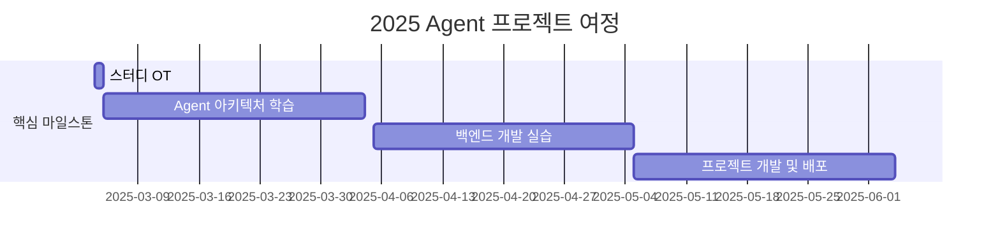

<h1 align="center">Agent is All You Need!</h1>

<div align="center">
<a href="https://pseudo-lab.com"></a>
<a href="https://discord.gg/EPurkHVtp2"></a>
<a href="https://github.com/Pseudo-Lab/10th-template/stargazers"></a>
<a href="https://github.com/Pseudo-Lab/10th-template/network/members"></a>
<a href="https://github.com/Pseudo-Lab/10th-template/pulls"></a>
<a href="https://github.com/Pseudo-Lab/10th-template/issues"></a>
<a href="https://github.com/Pseudo-Lab/10th-template/graphs/contributors"></a>
<a href="https://hits.seeyoufarm.com"></a>
</div>
<br>
<p align="center">
  
</p>

> Agent 시대의 도전! 이론에서 프로덕션까지, 실전 Agent 개발 스터디에 오신 것을 환영합니다. 우리는 최신 Agent 기술을 탐구하고 실제 서비스를 구현하는 여정을 함께합니다.


## 🌟 프로젝트 개요 (Project Overview)
<p align="center">

</p>
2025년은 'AI 에이전트'의 해로 주목받고 있습니다. 가트너의 예측에 따르면 2028년까지 일상 업무의 15%를 AI 에이전트가 독자적으로 결정할 것으로 전망되며, 이미 주요 기업들의 치열한 개발 경쟁이 시작되었습니다. 내 커리어, 내 주변, 사회적인 선한 영향력을 주제로 하는 실전에서 쓸 수 있는 Agent 를 개발하며 AI 뿐만아니라 CS 지식을 같이 개발하면서 대체불가 인력으로 성장을 목표로 합니다.
<br>  
<br>  
<h3 align="center">
  <p>🚨 대체당하기 싫다면 어서 합류하라! 🚨</p>
</h3>
<br>  


## 🎯 프로젝트 목표 (Project Vision)

### 이론 학습
- 🛠️ **최신 프레임워크 마스터링**
  - LangChain, LangGraph
  - LlamaIndex
  - AutoGen
  - Crew AI
  - hard coding 
- 🎯 **핵심 기술 역량**
  - Prompt Engineering
  - Agent 설계 패턴
  - 윤리적 고려사항
  - Multi-Agent 시스템

### 💻 실전 개발
- 🌐 **백엔드 아키텍처**
  ```
  FastAPI | Flask | Spring
  ```
- 🚀 **인프라 구축**
  ```
  Docker | Kubernetes | CI/CD
  ```
- 📊 **모니터링 시스템**
  ```
  로깅 | 메트릭스 | 알림
  ```

> **평소에 구현해보고 싶은게 없으셨나요? 같이 만들면서 성장해요 🌱**  
> 우리는 스터디가 끝났을때 아래와 같은 프로젝트를 개발 하고 공유합니다.

🔗 [MultiAgent Backend Repository](https://github.com/jh941213/multiagent_backend)


## 🧑 역동적인 팀 소개 (Dynamic Team)
| 이름 | 별명 | 소속 | 주요 경력 | 관심 영역 |
|--------|------|------|------------|----------|
| [김재현](https://www.linkedin.com/in/kjh941213/) | 김덕배 | KT ds | - WIZnet(Chip) AI Engineer | - 백엔드 개발<br>- 실제로 쓸 수 있는 에이전트 |
| [이진모](https://www.linkedin.com/in/jinmo-lee-3b5115253) | Alex | NH투자증권 | - KB국민카드 ML Engineer | - 폭발적 효율성의 Agent<br>- Graph Neural Network |
| [김현규](https://www.linkedin.com/in/hyeongyukim33) | NerdCat | NICE지니데이타 | - 피플즈리그 Researcher<br>- LIG넥스원 SW Engineer | - Multi-Agent, RAG<br>- LLM Serving<br>- Agent 상용화 |
| [이수현](https://www.linkedin.com/in/수현-이-5931912bb) | 와플 | 대학원생 | - AItheNutrigene 일학습병행 | - 생성형 모델, LLM<br>- 음성인식 분야 |
| [이윤아](https://www.linkedin.com/in/yoonah-l-b34536191/) | Lee | LVISKorea | - AI research engineer | - foundation model<br>- LLM 모델 |
| [백소정](https://www.linkedin.com/in/sojeong-baek/) | Phoebe | MongoDB | - 메가존클라우드 Solutions Architect | - RAG 및 AI Agent<br>- 다양한 사례 구현 |
| [박영웅](https://www.linkedin.com/in/youngwoong-park) | Hero | SKT | - AI Platform Manager | - Agent Readable Data 구축<br>- Workflow Orchestration<br>- API serving |
| [김태한](https://www.linkedin.com/in/taehan-kim-080099322/) | Hank | 취업준비 | - 네이버 부스트캠프 AI Tech<br>- 3D Focus Researcher | - 일상에 도움되는 Agent<br>- Multi Agent 시스템 |
| [이효정](https://www.linkedin.com/in/hyojung-lee-557890327/) | eehyo | MINDs and company | - AI Engineer Intern | - 실생활 접목 Agent<br>- NLP와 HCI |
| [김다현](https://www.linkedin.com/jobs/?originalSubdomain=kr) | dh | 디지털트윈 회사 | - 의료 회사 AI Research | - 업무 자동화 Agent<br>- 논문 작성 보조 Agent |
| [박상우](https://www.linkedin.com/in/bakch92) | 상쪽이 | KT| - SK Shieldus 모의해킹<br>- 한국통신인터넷기술 | - 금융 데이터 투자 예측 Agent<br>- Multi Agent 구축 |
| [이재환](https://www.linkedin.com/in/jaehwlee/) | Jae | 컴투스 | - 솔트룩스, Audio Research | - 업무 생산성 향상<br>- 클린 코드 |
| [김승혁](https://www.linkedin.com/in/승혁-김-9092b5306) | - | 자기계발 중 | - 마음AI | - LLM, Agent, RAG, Prompt<br>- A부터 Z까지 혼자 구축 |
| [함현정](https://www.linkedin.com/in/hyeonjung-ham-97333721b) | Ham | (주)유케어트론 | - Flutter 개발 2년차<br>- AI 3D estimation 프로젝트 | - Computer vision<br>- 3D modeling<br>- AI agent 개발 |
| [채병주](https://www.linkedin.com/in/byungjoo-chae-baa661198) | 우니 | 컨텐츠 기반 AI 스타트업 | - Dexter Studios | - RAG, Agent 기술<br>- Diffusion<br>- mlops 구축 |
| [조수현](https://www.linkedin.com/in/%EC%88%98%ED%98%84-%EC%A1%B0-a1617a335/) | Su | 공공기관 연구직 | - 부산대학교 AI 전공 석사 | - AI Agent 개발<br>- Computer Vision 및 VLM |
| [김태연](https://www.linkedin.com/in/taeyeon-kim-041287223) | 김탱자🍊 | KTcs | - 국립국어원 Researcher | - Agent, Hybrid Chatbot<br>- Prompt, RAG |
| [백두산](https://www.linkedin.com/in/dusanbaek/) | 백두산 | 산업공학 석사 재학 | - 개인 iOS 앱 개발 및 런칭 | - Human Factors<br>- Human-AI Interaction<br>- iOS |
| [신현지](https://www.linkedin.com/in/%ED%98%84%EC%A7%80-%EC%8B%A0-99015a200/) | 조이 | 이직 준비 중 | - 음성/발화 건강 AI 스타트업 | - 맞춤형 Agent 개발 |
| [김재연](https://www.linkedin.com/in/jaeyeon-kim-7071552a9/) | 재연 | KT | - AI Engineer | - 프롬프트 엔지니어링<br>- RAG, Agent |
| [이진선](https://www.linkedin.com/in/jin-sun-lee-128b8730a) | 잔산 | 노스스타컨설팅 | - 자바 개발자 | - 자바 개발<br>- AI agent 개발 |


## 🚀 프로젝트 로드맵 (Project Roadmap)


## 📅 주차별 활동 (Activity History)

## 일정 개요
| 주차   | 날짜         | 내용                                         | 발표자 |
|--------|------------|--------------------------------------------|--------|
| 1주차  | 2025/03/09 | OT & 아이스브레이킹                        | -      |
| 2주차  | 2025/03/16 | 팀 개편 및 주제 선정                        | 미정   |
| 3주차  | 2025/03/23 | Agent 관련 논문 발표 및 프로젝트 상황 공유  | 미정   |
| 4주차  | 2025/03/30 | Magical Weeks 🧙 | 미정   |
| 5주차  | 2025/04/06 | Agent 관련 논문 발표 및 프로젝트 상황 공유  | 미정   |
| 6주차  | 2025/04/13 | Agent 관련 논문 발표 및 프로젝트 상황 공유  | 미정   |
| 7주차  | 2025/04/20 | Agent 관련 논문 발표 및 프로젝트 상황 공유  | 미정   |
| 8주차  | 2025/04/27 | Magical Weeks 🧙  (with 빌더 루프탑 바베큐 🍖) | 미정   |
| 9주차  | 2025/05/04 | Agent 관련 논문 발표 및 프로젝트 상황 공유  | 미정   |
| 10주차 | 2025/05/11 | Agent 관련 논문 발표 및 프로젝트 상황 공유  | 미정   |
| 11주차 | 2025/05/18 | 프로젝트 최종 점검                          | 미정   |
| 12주차 | 2025/05/25 | 최종 프로젝트 발표                          | 전원   |

## 🛠️ 우리의 개발 문화 (Our Development Culture)
```python
class CollaborationFramework:
    def __init__(self):
        self.tools = {
            'communication': 'Discord',
            'version_control': 'GitHub Projects',
            'ci/cd': 'GitHub Actions',
            'docs': 'Github Wiki'
        }
    
    def workflow(self):
        return """주간 사이클:
        1️⃣ 주말 "모각코" 진행 (선택) 
        2️⃣ Self-Brading (나를 알립시다)
        3️⃣ Creative Spark⚡️ 모두에게 창의력을 !"""
```

## 📈 성과 지표 (Achievement Metrics)
**2025 주요 KPI**
| 지표 | 목표치 | 현재 달성률 |
|------|---------|-------------|
| Agent 구현 프로젝트 | n 개 | 0% |
| 기술 블로그 포스팅 | 조정중| 0% |

## 🌱 참여 안내 (How to Engage)
**팀원으로 참여하시려면 러너 모집 기간에 신청해주세요.**  
- 링크 (준비중)

**누구나 청강을 통해 모임을 참여하실 수 있습니다.**  
1. 특별한 신청 없이 정기 모임 시간에 맞추어 디스코드 #Room-GH 채널로 입장
2. Magical Week 중 행사에 참가
3. Pseudo Lab 행사에서 만나기

## Acknowledgement 🙏

OOO is developed as part of Pseudo-Lab's Open Research Initiative. Special thanks to our contributors and the open source community for their valuable insights and contributions.

## About Pseudo Lab 👋🏼</h2>

[Pseudo-Lab](https://pseudo-lab.com/) is a non-profit organization focused on advancing machine learning and AI technologies. Our core values of Sharing, Motivation, and Collaborative Joy drive us to create impactful open-source projects. With over 5k+ researchers, we are committed to advancing machine learning and AI technologies.

<h2>Contributors 😃</h2>
<a href="https://github.com/Pseudo-Lab/Agent_is_all_you_need/graphs/contributors">
  
</a>
<br><br>


## License 🗞
This project is licensed under the [MIT License](https://opensource.org/licenses/MIT).
